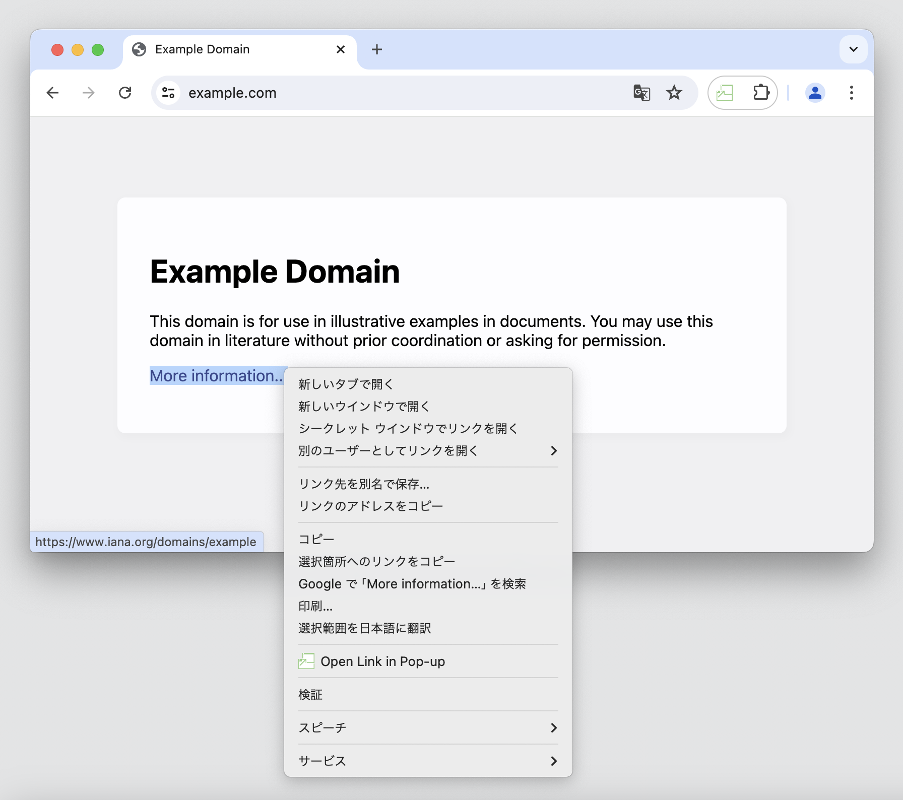

# Popper

Chrome Extension to pop up tabs or links

## Features

- Click on the action button or set a keyboard shortcut from `chrome://extensions/shortcuts` to pop up the current tab.
- Open the context menu and click on the menu to pop up a link or frame.

